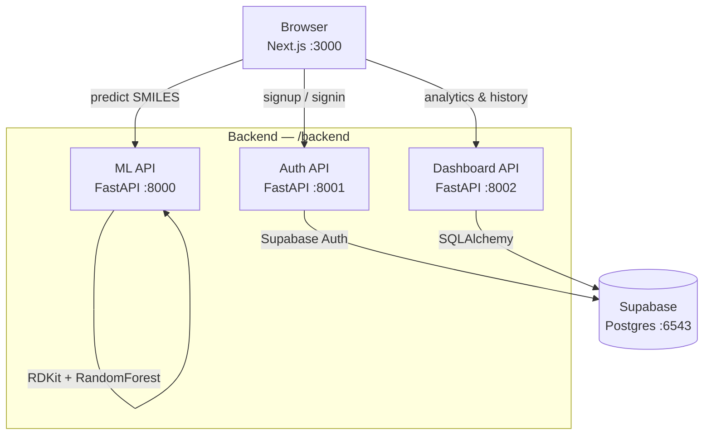

# MolSol — Molecular Solubility Prediction

Predict aqueous solubility (LogS) of molecules from SMILES notation. Built with Next.js, FastAPI, RDKit, and Supabase.

Access it here - https://molecular-solubility-prediction-fqj.vercel.app/

---

## Architecture



---

## Stack

| Layer      | Tech                                       |
| ---------- | ------------------------------------------ |
| Frontend   | Next.js 15, React 19, Tailwind v4, shadcn/ui |
| ML API     | FastAPI, scikit-learn, RDKit, PubChemPy    |
| Auth API   | FastAPI, Supabase Python client            |
| Dashboard  | FastAPI, SQLAlchemy, psycopg2              |
| Database   | Supabase PostgreSQL (pooler port 6543)     |

---

## Local Setup

### 1. Clone

```bash
git clone https://github.com/AtharshKrishnamoorthy/Molecular-Solubility-prediction
cd Molecular-Solubility-prediction
```

### 2. Backend

```bash
cd backend
python -m venv .venv && source .venv/Scripts/activate  # Windows
pip install -r requirements.txt

# Copy and fill env
cp .env.example .env
```

Start each API in a separate terminal:

```bash
# ML API — http://localhost:8000
uvicorn api:app --reload --port 8000

# Auth API — http://localhost:8001
uvicorn auth.api:app --reload --port 8001

# Dashboard API — http://localhost:8002
uvicorn dashboard.api:app --reload --port 8002
```

### 3. Frontend

```bash
cd frontend
npm install
```

Create `frontend/.env.local`:

```env
NEXT_PUBLIC_API_URL=http://localhost:8000
NEXT_PUBLIC_AUTH_API_URL=http://localhost:8001
NEXT_PUBLIC_DASHBOARD_API_URL=http://localhost:8002
```

```bash
npm run dev   # http://localhost:3000
```

---

## Backend `.env` Variables

```env
USER=postgres.<project-ref>
PASSWORD=<your-db-password>
HOST=aws-0-<region>.pooler.supabase.com
PORT=6543
DBNAME=postgres
SUPABASE_URL=https://<project-ref>.supabase.co
SUPABASE_ANON_KEY=<anon-key>
```

---

## License

MIT


